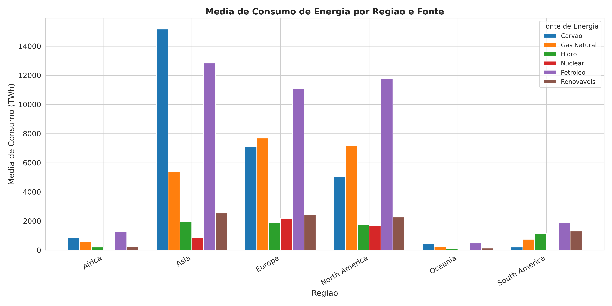

# Grafico de Barras — Media de Consumo por Regiao e Fonte de Energia

**O que mostra:** A media historica de consumo de energia (em TWh) para cada regiao do mundo, separada por fonte: carvao, petroleo, gas natural, nuclear, renovaveis e hidro.

**Interpretacao:**
- **Asia** domina o consumo de carvao (15.171 TWh) e petroleo (12.836 TWh), refletindo a industrializacao acelerada de China e India.
- **Europa** e **America do Norte** tem consumo elevado e mais diversificado, com participacao significativa de gas natural e nuclear.
- **America do Sul** se destaca pelo alto uso de hidro (1.121 TWh) e renovaveis (1.308 TWh), impulsionado pelo potencial hidroeletrico do Brasil.
- **Africa** e **Oceania** tem os menores consumos absolutos em todas as fontes.
- O petroleo e a fonte mais consumida na maioria das regioes, exceto na Asia onde o carvao lidera.
