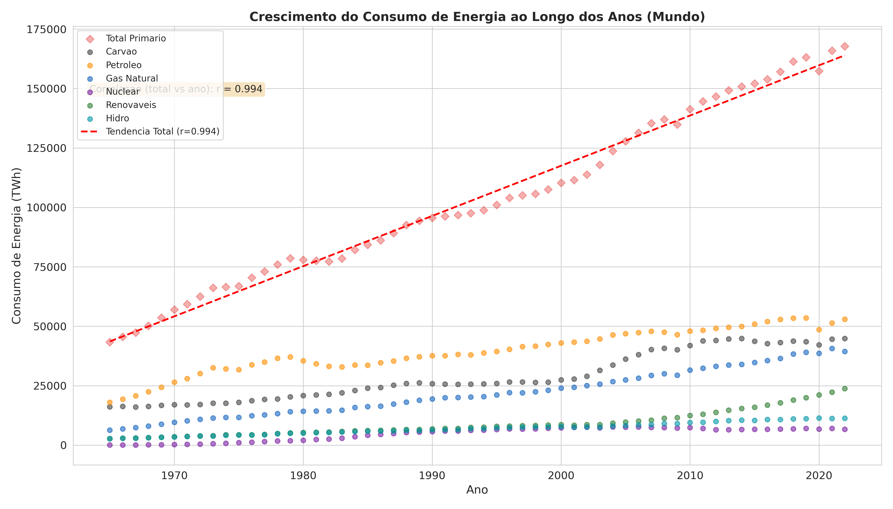

# Grafico de Dispersao — Crescimento do Consumo ao Longo dos Anos

**O que mostra:** Cada ponto representa o consumo mundial de uma fonte de energia em um ano especifico. A linha vermelha tracejada e a regressao linear do consumo total de energia primaria ao longo do tempo.

**Correlacao (consumo total vs ano): r = 0.994** — correlacao quase perfeita, indicando crescimento praticamente linear do consumo total ao longo das decadas.

**Interpretacao:**
- O consumo de **petroleo** (laranja) e **carvao** (cinza) dominaram historicamente, mas o carvao mostra estabilizacao nos ultimos anos.
- O **gas natural** (azul) cresceu de forma consistente a partir dos anos 1960.
- **Nuclear** (roxo) cresceu entre 1970-2000 e estabilizou.
- **Renovaveis** (verde) e **hidro** (ciano) mostram crescimento acelerado nas ultimas decadas.
- O padrao geral e de crescimento continuo, com o consumo mundial passando de ~25.000 TWh em 1965 para mais de 140.000 TWh em 2022.
