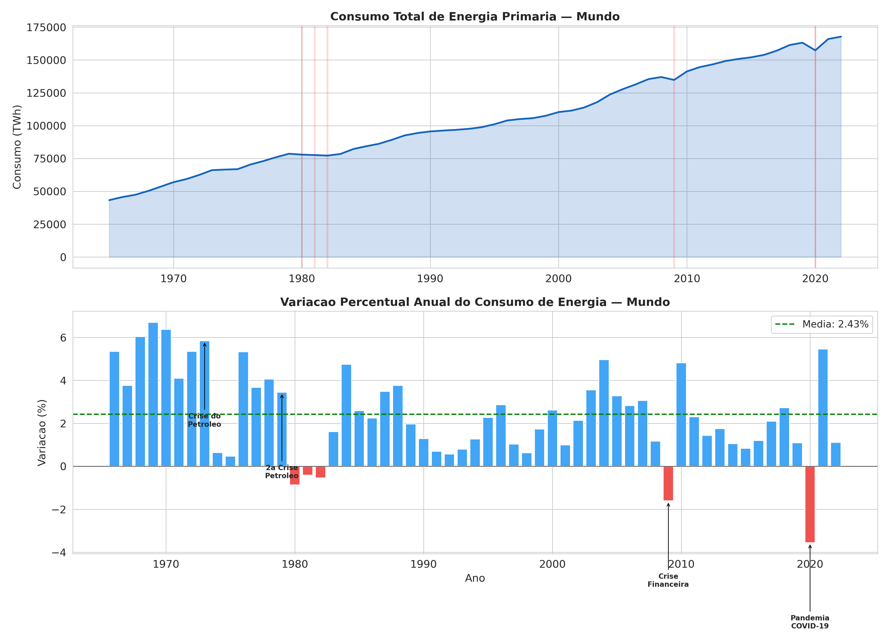

# Variacoes no Consumo de Energia — Analise Ano a Ano

**O que mostra:** Dois graficos empilhados:
1. **Superior:** Consumo total de energia primaria ao longo do tempo (linhas vermelhas verticais marcam anos de queda).
2. **Inferior:** Variacao percentual ano a ano. Barras azuis = crescimento, barras vermelhas = queda.

**Como o dataset tem dados anuais (sem granularidade mensal), a analise foca em variacoes ciclicas ano-a-ano em vez de sazonalidade mensal.**

**Interpretacao:**
- A variacao media anual e de **+2.43%**, indicando crescimento consistente.
- Apenas **5 anos** registraram queda no consumo global:
  - **2020 (-3.56%):** Pandemia COVID-19 — maior queda da historia
  - **2009 (-1.61%):** Crise financeira global
  - **1980 (-0.87%):** Segunda crise do petroleo
  - **1982 (-0.54%):** Recessao global
  - **1981 (-0.41%):** Efeitos prolongados da crise de 1979
- Esses eventos estao anotados no grafico, mostrando que quedas no consumo de energia estao fortemente correlacionadas com crises economicas globais.
- O consumo de energia e extremamente resiliente — mesmo em crises, as quedas sao relativamente pequenas e seguidas de recuperacao rapida.
