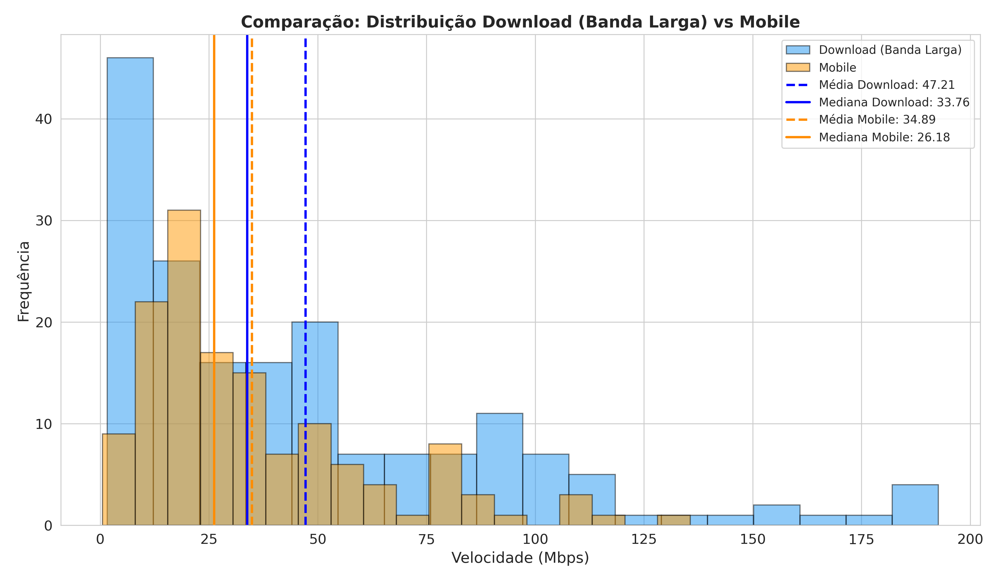

# Histograma Comparativo — Download vs Mobile

**O que mostra:** Os dois histogramas sobrepostos para comparacao direta entre velocidades de banda larga (azul) e mobile (laranja).

**Linhas de referencia:**
- **Azul tracejado/solido** = Media e mediana de download
- **Laranja tracejado/solido** = Media e mediana de mobile

**Interpretacao:** As velocidades de banda larga tem amplitude maior (1.62 a 192.68 Mbps) comparadas as mobile (0.53 a 135.62 Mbps). A banda larga possui uma cauda direita mais longa, com paises como Monaco e Singapura distantes da maioria. Ja a distribuicao mobile e mais concentrada em faixas mais baixas. Ambas as distribuicoes compartilham o formato assimetrico, refletindo a desigualdade digital global.

## Resumo Estatistico

| Metrica | Download (Banda Larga) | Mobile |
|---|---|---|
| Paises analisados | 179 | 139 |
| Media | 47.21 Mbps | 34.89 Mbps |
| Mediana | 33.76 Mbps | 26.18 Mbps |
| Desvio Padrao | 43.67 | 26.69 |
| Minimo | 1.62 Mbps | 0.53 Mbps |
| Maximo | 192.68 Mbps | 135.62 Mbps |
| Assimetria | 1.37 | 1.41 |
| Curtose | 1.60 | 1.76 |
