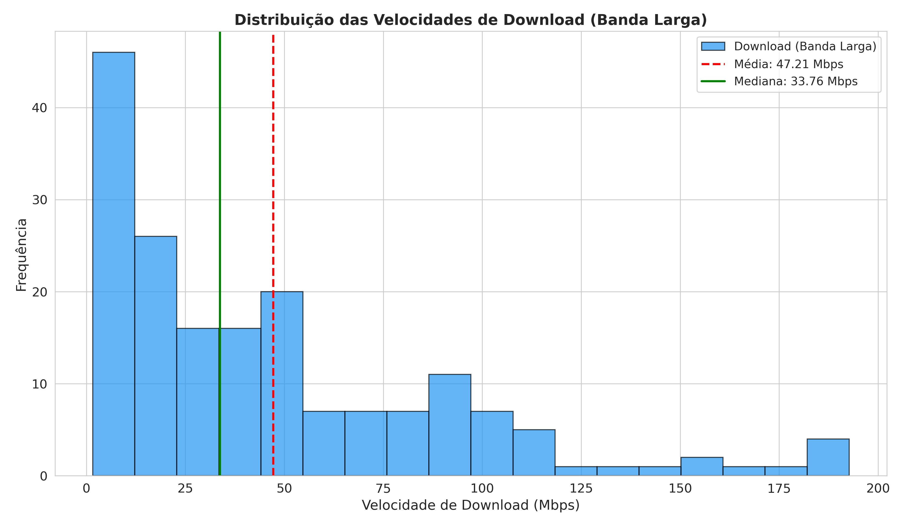

# Histograma — Velocidade de Download (Banda Larga)

**O que mostra:** A distribuicao das velocidades de banda larga entre os 179 paises.

**Linhas de referencia:**
- **Vermelha tracejada** = Media (47.21 Mbps)
- **Verde solida** = Mediana (33.76 Mbps)

**Interpretacao:** A distribuicao e **assimetrica a direita** (assimetria = 1.37). Isso significa que a maioria dos paises tem velocidades baixas (concentracao a esquerda), enquanto poucos paises puxam a media para cima com velocidades muito altas. A diferenca entre media (47.21) e mediana (33.76) confirma essa assimetria — mais da metade dos paises tem velocidade abaixo da media global.
