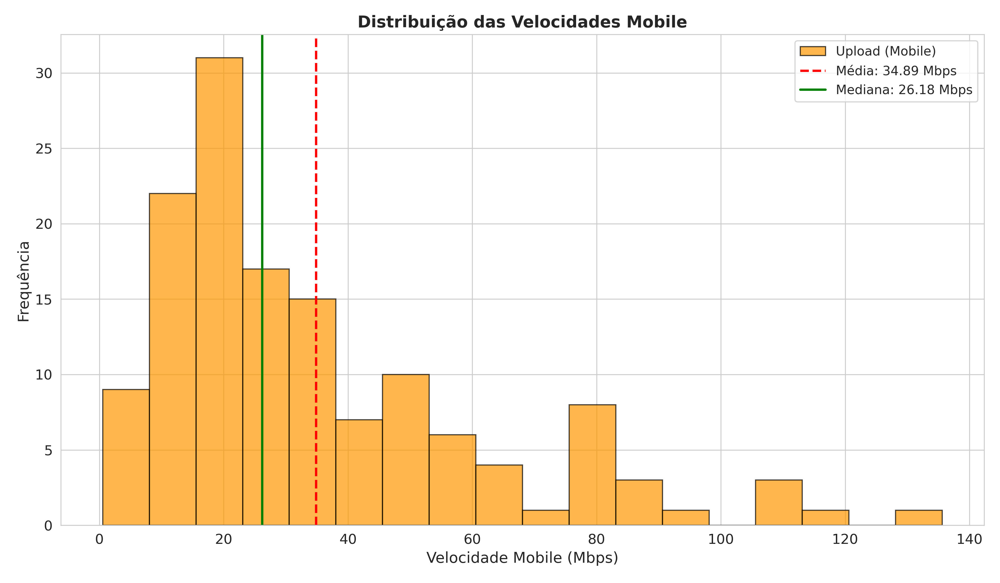

# Histograma — Velocidade Mobile

**O que mostra:** A distribuicao das velocidades mobile entre os 139 paises com dados disponiveis (40 paises nao possuem dados mobile).

**Linhas de referencia:**
- **Vermelha tracejada** = Media (34.89 Mbps)
- **Verde solida** = Mediana (26.18 Mbps)

**Interpretacao:** Padrao semelhante ao download — distribuicao **assimetrica a direita** (assimetria = 1.41). A maioria dos paises tem velocidade mobile abaixo de 30 Mbps, com poucos paises (como Emirados Arabes e Noruega) alcancando velocidades acima de 100 Mbps. A variancia (712.17) e menor que a de download (1907.41), indicando que as velocidades mobile sao menos dispersas entre os paises.
