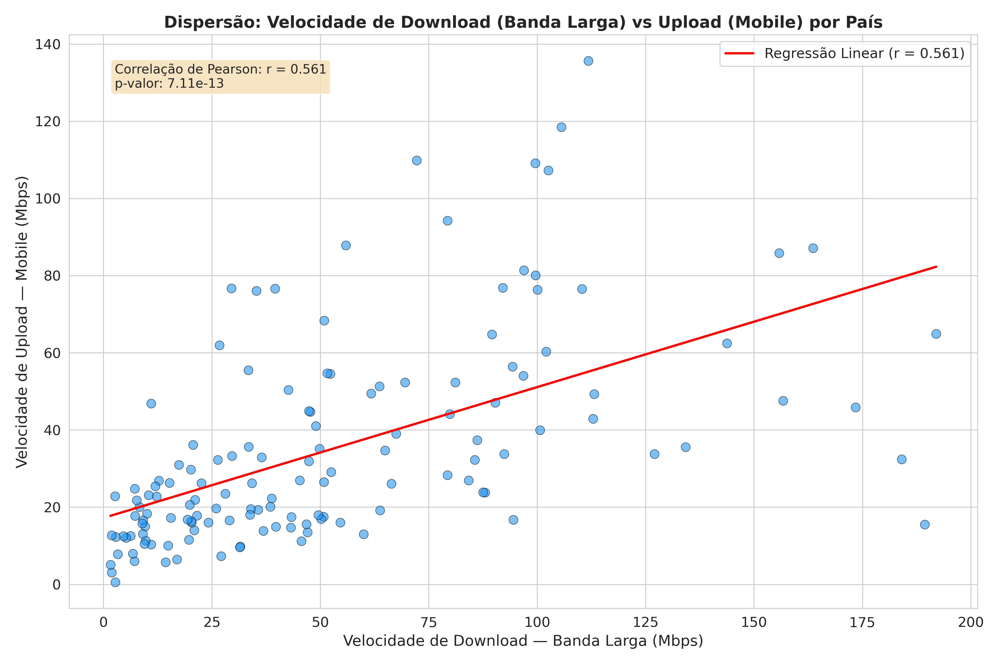

# Grafico de Dispersao — Download vs Mobile

**O que mostra:** A relacao entre a velocidade de banda larga (eixo X) e a velocidade mobile (eixo Y) para cada pais. Cada ponto representa um pais.

**Linha de tendencia:** A reta vermelha e a regressao linear, que indica a tendencia geral da relacao entre as duas variaveis.

**Correlacao de Pearson (r = 0.561):** Indica uma correlacao **moderada positiva** — ou seja, paises com banda larga mais rapida tendem a ter velocidade mobile maior tambem, mas a relacao nao e forte. Ha paises que fogem ao padrao: por exemplo, Bulgaria e Croacia tem mobile muito rapido mas banda larga mediana, enquanto Chile e Monaco tem banda larga altissima mas mobile mais baixo ou sem dados.

**Interpretacao:** Os investimentos em infraestrutura fixa e movel nao caminham sempre juntos. Alguns paises priorizaram redes moveis (4G/5G) sobre fibra optica, e vice-versa.
